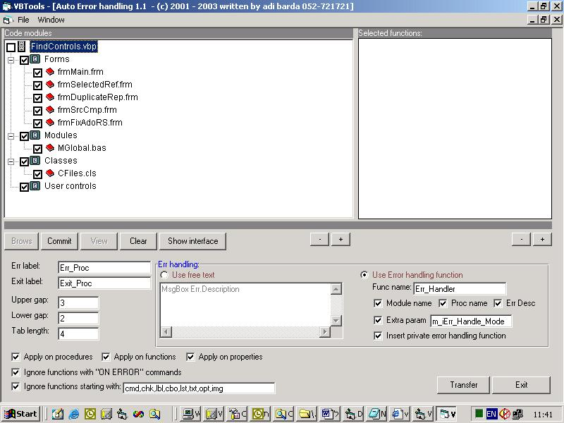



## Abware automatic error handling tool

### Description

Abware automatic error handling tool. This is the new version of my well known 'Automatic

error handling tool'. the amount of downloads and the grades you gave it, encourage me to

upgrade the tool and share it with you guys. The latest tool has all the functions of the

last one including some bug fixes, MUCH better GUI, faster algorithms. You can brows for a

VBP project and the tool automaticaly finds all its modules and functions and if you like

it will insert error handling code automaticaly to all the functions you selected. there is

a color view of the code before and after the changes and only by pressing the 'TRANSFER'

button will commit your action. additionaly, you can view the code interface which is the

function declaration with the remarks but with out the code so you have good view of the

functionality of the module. The tool also inserts a centeral error handling function to

deal with all the errors. I used this tool in a very big projects (100+ ctls, 100+ forms,

50+ modules) and it worked lighting fast. In return to sharing you this tool, i only ask

you to report bugs if you find'em. Thank u very much. Adi barda israel.
 
### More Info
 

             |
---                |---
**Submitted On**   |2003-10-13 18:27:28
**By**             |[ADI BARDA](https://github.com/Planet-Source-Code/PSCIndex/blob/master/ByAuthor/adi-barda.md)
**Level**          |Advanced
**User Rating**    |4.8 (43 globes from 9 users)
**Compatibility**  |VB 6\.0
**Category**       |[Complete Applications](https://github.com/Planet-Source-Code/PSCIndex/blob/master/ByCategory/complete-applications__1-27.md)
**World**          |[Visual Basic](https://github.com/Planet-Source-Code/PSCIndex/blob/master/ByWorld/visual-basic.md)
**Archive File**   |[Abware\_aut16610610202003\.zip](https://github.com/Planet-Source-Code/adi-barda-abware-automatic-error-handling-tool__1-49342/archive/master.zip)

